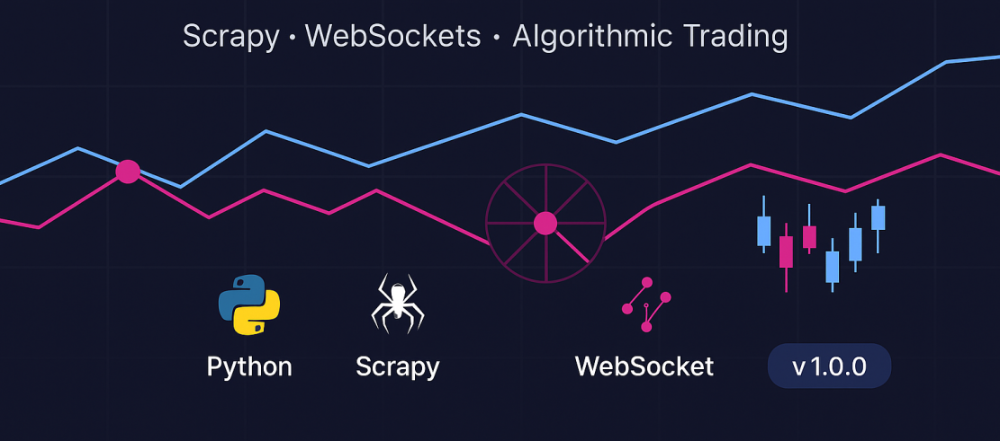

# Tasks



Different scraping, websocket, API integration with background Asnc celery tasks for multiprocessing and multithreading tasks.


## ***Task 1 & 3***

Write a code to get two years data (1st jan 2021 to 31st dec 2022) of 15 minute interval for symbol: BTCUSD for any category,
output result format: pandas dataframe, convert timestamp to datetime with IST timezone and set datetime column as dataframe index,
and add VWAP and MACD columns (check https://github.com/twopirllc/pandas-ta for vwap and macd calculations)


Same as 1 but get data for 5 symbols at the same time using threading/multiprocessing
symbols: BTCUSD, ETHUSD, BITUSD, SOLUSD, XRPUSD

### Output csv Files

 - [BTCUSD data for inverse category from 2021 to 2025](https://github.com/harshilhh/Treading_tasks/blob/main/First%20%26%20Third/BTCUSDT_inverse_15_2021-01-01_2024-12-31.csv)

  - [BTCUSD data for spot category](https://github.com/harshilhh/Treading_tasks/blob/main/First%20%26%20Third/BTCUSDT_spot_15_2021-01-01_2024-12-31.csv)

.


## 📦 Requirements

Install all dependencies:

```bash
  pip install -r requirements.txt
```

## 🛠 Setup & Usage

### 🧭 Step 1: Start Redis Server

Make sure Redis is installed and running locally.

### 🧭 Step 2: Start Celery Worker

```bash
  celery -A data worker --loglevel=info

```

### 🧭 Step 3: Fill in Parameters

```bash
# inside run.py
from data import run_task

symbol = "BTCUSDT"
category = "inverse"
start_date = "2024-12-01 00:00"
end_date = "2024-12-31 23:45"

run_task(start_date, end_date, symbol, category)


```
### 🧭 Step 4: Run the Task

```bash
  python3 run.py

```

### ❓ Why Use Celery?
- Celery is a distributed task queue system that uses multiprocessing, bypassing Python’s GIL limitations.

- It is ideal for long-running or I/O-heavy tasks such as API requests or data processing.

- Celery allows parallel execution of multiple download jobs using multiple workers.


## ***Task 2***

Write code to scrape option chain for given symbol and expiry date from NSE new website and export it to excel
url: https://www.nseindia.com/option-chain


A **Scrapy spider** for extracting **NSE (National Stock Exchange of India)** options data (calls and puts) based on a specific **symbol** or **index option (like NIFTY/BANKNIFTY)** for a given expiry date.

### Output csv Files
 - [Nifty Expiry date 8-May-2025](https://github.com/harshilhh/Treading_tasks/blob/main/Sec/nse_options/Nifty_8-May-2025.csv)

  - [ABB Expiry date 29-May-2025](https://github.com/harshilhh/Treading_tasks/blob/main/Sec/nse_options/ABB_29-May-2025.csv)

---

## 🚀 How to Run This Spider

Follow the steps below to run the spider with your desired parameters:

---

### 🧭 Step 1: Navigate to Project Directory

Open your terminal and run:

```bash
cd /Sec/nse_options

```


### 🐍 Step 2: Run the Spider

You can run the spider with either a symbol (e.g., RELIANCE, ABB) or an index option (e.g., NIFTY).
⚠️ Note: You can pass only one argument at a time — either symbol or options.

▶ Using a Symbol:

```bash
scrapy crawl nse_spider -a symbol=RELIANCE -a date=2025-05-29 -o RELIANCE_29-May-2025.csv

```
▶ Using an Option (Index):

```bash
scrapy crawl nse_spider -a options=NIFTY -a date=2025-05-08 -o Nifty_8-May-2025.csv
```

📂 Output Format
- You can export the data to CSV or JSON format using the -o flag.

- The output file will contain the parsed options chain data for the specified date and entity.

⚠ Important Notes
- ✅ Only one of symbol or options can be used at a time.

- 🗓 Ensure the date provided is a valid NSE expiry date.

- 📁 Use descriptive filenames for easier tracking (e.g., RELIANCE_29-May-2025.

## ***Task 4***
Get dividend date information from here, https://www.boerse-frankfurt.de/equity/adidas-ag/company-details,
without using selenium or other browser automation tool, keep symbol as parameter for fetching data

### 📈 Börse Frankfurt Dividend Information Fetcher

This Python script fetches dividend information for a given ISIN from the [Börse Frankfurt](https://www.boerse-frankfurt.de/) API and saves it into a CSV file.


### Output csv Files
 - [Adidas dividend csv file](https://github.com/harshilhh/Treading_tasks/blob/main/Fourth/dividend_data.csv)


---

⚠️ Notes
- Make sure the API accepts your request. Some requests may require valid session headers/cookies.

- If you receive an empty response ({}), try updating x-client-traceid and client-date.


## ***Task 5***

Write a code to get public live order book data for BTCUSDT spot over web socket connection

documentation:
https://bybit-exchange.github.io/docs/v5/ws/connect

use empty string as api key and secret, it's ok if authentication fails, we still receive data as it is public endpoint
api_key = ""
api_secret = ""

websocket url = 'wss://stream.bybit.com/v5/public/spot'

### 📡 Bybit WebSocket Order Book Client

A Python script to connect to Bybit's **public WebSocket API** and receive real-time order book updates for `BTCUSDT` (Spot market).

### 🚀 Features

- Real-time order book updates (top 5 bids/asks)
- Automatic reconnection on disconnect
- Heartbeat (ping/pong) to keep the connection alive
- Clean logging and error handling

▶️ How to Run

```bash
python3 bybit_orderbook_ws.py

```

### Contributing
Feel free to contribute by submitting issues or pull requests.

### License
This project is open-source under the MIT License.